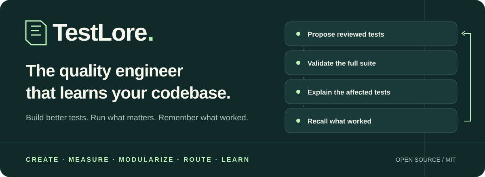
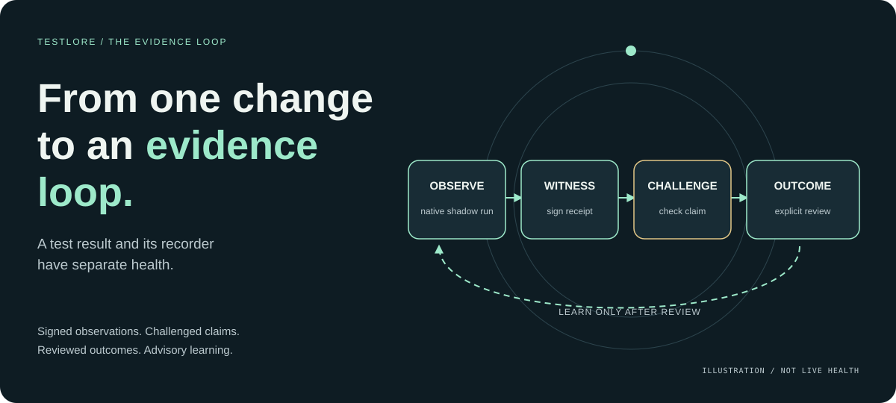
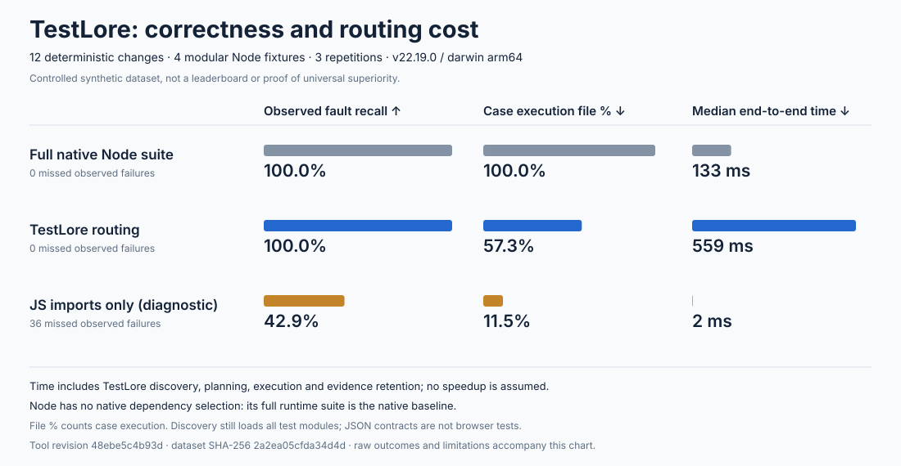
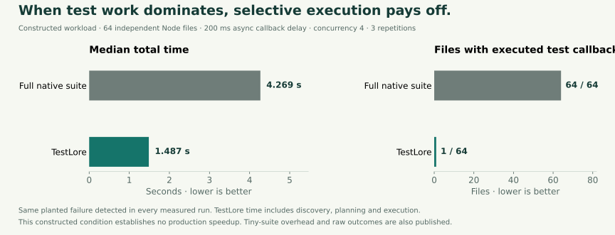

<p align="center">
  
</p>

<p align="center">
  <strong>Your quality engineer. Your tools. Evidence you can inspect.</strong><br />
  An open-source quality-engineering layer for developers and coding agents.
</p>

<p align="center">
  <a href="LICENSE"></a>
  <a href="package.json"></a>
  <a href="https://github.com/rudycelekli/testlore/actions/workflows/ci.yml"></a>
  <a href="docs/roadmap.md"></a>
</p>

<p align="center">
  <a href="#start-in-one-command">Quick start</a> ·
  <a href="#a-quality-engineer-inside-your-repository">How it works</a> ·
  <a href="#from-one-change-to-an-evidence-loop">Evidence loop</a> ·
  <a href="#learning-that-stays-with-your-project">Learning</a> ·
  <a href="#show-the-evidence">Benchmarks</a> ·
  <a href="docs/configuration.md">Documentation</a> ·
  <a href="CONTRIBUTING.md">Contribute</a>
</p>

## A quality engineer inside your repository

Every change deserves an understandable test plan.

TestLore brings **test creation, intelligent routing and reviewed learning** into one inspectable workflow. It proposes improvements on an isolated branch, preserves your existing regression tests, and explains what each change needs to prove.

**Keep your best tools.** Your native engines supply the expertise. TestLore adds the shared quality contract: modular dependencies, independent validation, reasons for every proposed omission, and a memory of reviewed outcomes.

| Your starting point | What TestLore does |
| --- | --- |
| **No tests yet** | An architect, bounded author team, and independent reviewer propose runnable tests from your behavioral requirements. |
| **Tests exist, confidence is unclear** | Audit structure, import actual coverage and mutation results, measure stability, and surface gaps with their evidence. |
| **A growing suite slows development** | Follow static, declared, and observed dependencies to select affected test files, with reasons and conservative fallbacks. |
| **Knowledge disappears between sessions** | Retain validated examples, reviewed outcomes and rejection signals; retrieve relevant advisory history for future agents. |

## Start in one command

Give your repository its own quality engineer. One command sets up **shadow verification** and CI:

```sh
npm exec --yes --package=github:rudycelekli/testlore -- testlore setup
```

Add `--verify` to configure the project and immediately record a **full shadow run** in the same command:

```sh
npm exec --yes --package=github:rudycelekli/testlore -- testlore setup --verify --json
```

This executes your configured native tests, preserves their failure exit, and saves an inspectable report. Ordinary setup only writes configuration. Run `testlore report` to inspect outcomes, proposed omissions and uncertainty.

Review and commit the setup files. To generate independently reviewed test improvements on a new isolated branch and open a validated PR, run from a clean, committed checkout:

```sh
npm exec --yes --package=github:rudycelekli/testlore -- testlore improve
```

**Experimental alpha:** the implementation is merged into `main`. Pin a reviewed commit for reproducibility. Install from GitHub; an npm alpha release requires separate publisher setup and exact-artifact qualification. [Adoption and pilots →](docs/adoption.md)

Requires **Node 22.19+ and Git**. It creates your project’s quality-agent identity and local memory immediately. Existing `SPEC.md`, `REQUIREMENTS.md`, or README material can seed a proposed behavior contract on the branch. Commit `tddswarm.requirements.md` for explicit expectations; proposals without meaningful independent behavior must be rejected. Generation uses your configured worker or an installed, authenticated Codex CLI. Automatic PR creation uses your authenticated GitHub CLI. `--local` keeps the result for local review.

The default flow:

```text
Your repository
    ↓
Isolated improvement branch
    ↓
Architect → Authors → Independent reviewer
    ↓
Original suite + candidate suite + full branch validation
    ↓
GitHub pull request for your review
    ↓ after you merge
Audit + shadow validation on PRs · full tests on default-branch pushes
```

Failed validation retains the proposal and its evidence for inspection. Missing requirements or a worker produces a concrete work order. Merging remains your decision. [Full workflow →](docs/improvement.md)

Personalize your project agent:

```sh
npm exec --yes --package=github:rudycelekli/testlore -- testlore agent --name "My project quality engineer" --json
```

The agent runs when you invoke it or CI; its identity and history persist between runs. Customize `qualityAgent.name` and `qualityAgent.focus` in project configuration.

`npm exec` uses a temporary package for that invocation. Before running any `npx --no-install testlore` commands below, including learning commands, install it locally with `npm install --save-dev github:rudycelekli/testlore`.

Want a useful report before configuring agents?

```sh
npm exec --yes --package=github:rudycelekli/testlore -- testlore init
npm install --save-dev github:rudycelekli/testlore
npx --no-install testlore doctor --json
npx --no-install testlore audit --json
npx --no-install testlore run --shadow --base HEAD
```

Local analysis and routing require no AI account. Generation may consume your selected worker's allowance.

## From one change to an evidence loop

[](docs/evidence-loop.md)

Register an expected result, run native full shadow verification, sign its receipt, challenge the claim, and record an explicit review. Only reviewed outcomes become advisory lessons. The loop distinguishes failed tests, tests that never started, missing witnesses and altered receipts. An independently retained public key authenticates the recorder; an external checkpoint helps detect removed history.

```sh
npx --no-install testlore witness-init --output ../testlore-witness.pub.pem
npx --no-install testlore observe --revision "candidate-1" --output ../testlore-checkpoint.json --json
npx --no-install testlore loop-status --trusted-key ../testlore-witness.pub.pem --checkpoint ../testlore-checkpoint.json --json
```

Signatures establish recorder identity. Revision labels and reviewer names remain operator assertions; this local loop does not verify a live serving revision. Tests do not establish deployment safety, and reviewed memory does not establish learning improvement. [Evidence contract and outcome commands →](docs/evidence-loop.md) · [Interactive visual explanation →](docs/index.html)

## The verification contract for coding agents

Before an agent changes code, give it a concrete quality brief:

```sh
npx --no-install testlore brief --query "Verify the checkout behavior change" --json
```

The brief names independent expectations, native scope, input uncertainty, regression preservation and bug-detection evidence. It reads bounded static project data without invoking your runner, resolvers or service probes. Static assertion counts carry no effectiveness claim; old receipts carry no current certification.

Connect your coding agent through **MCP stdio**:

```sh
npx --no-install testlore mcp --root /absolute/project
```

Inspection is the default. Start with `--allow-execution` to let an agent request the configured native plan and full shadow verification. The server stays bound to one project; tool arguments cannot grant permissions, change the root, supply arbitrary commands, or merge changes. Work is supervised and serialized, with bounded summaries and durable receipts. Your native test engine and independent review retain authority. [Agent tools and configuration →](docs/mcp.md)

The useful loop is **brief → independent expectations → native plan → shadow verification → reviewable evidence**. TestLore gives agents a shared way to describe what a change needs to prove, alongside the testing tools you already use.

## A paragraph edit deserves an understandable plan

```text
AFFECTED · 1/2 test files selected

RUN   test/landing.test.js
      test/landing.test.js → public/copy.json
      reason: dependency-path

SKIP  test/checkout.test.js
      reason: no-known-dependency-on-change
```

Copy, styles, templates, localization, schemas, fixtures, and services can all affect behavior. Declare their relationships or capture runtime reads. TestLore combines these with static dependencies and explains its choices. Unresolved source dependencies retain every consuming test on every active change. Configuration, registration, discovery, unknown changed inputs and stale authority retain full fallback. Tooling outside test closures is reported separately. [Precision contract →](docs/precise-routing.md)

Run `npm run demo` for a selective copy edit, a shared dependency, and an uncertain change. Selection works at **test-file granularity**; native execution reports individual cases. New installations default to shadow mode; `--selective` explicitly opts into the proposed subset. Shadow mode runs the full suite while checking the proposed selection against observed failures. [Routing configuration →](docs/configuration.md)

## Learning that stays with your project

```text
RETAIN                        RECALL                        REFLECT
Validated test patterns  →   Relevant historical examples → Supported recommendations
Rejection signals             Source compatibility labels   Evidence IDs and counts
       ↑                              │                           │
       └────────────── future reviewed, validated proposals ──────┘
```

Every validated proposal can contribute to local memory. Architects and authors retrieve bounded examples with framework, source, environment, outcome, and age metadata. Independent reviewers receive requirements and candidates separately. Reflections point to the records supporting them.

```sh
npx --no-install testlore learn --json
npx --no-install testlore recall --query "boundary validation" --json
npx --no-install testlore learning-export --json
```

The default learning loop uses deterministic lexical retrieval and evidence-backed recommendations. An optional RuVector plugin adds native vector retrieval over the same validated lessons. Its default feature vectors are lexical; semantic embeddings require an explicitly configured model provider. Historical snippets are advisory; current requirements and execution determine acceptance. It does not train model weights. Memory stays local, including across improvement branches. Explicit aggregate export contains fixed counts without source, paths, or project identifiers. Disable learning with `"learning": {"enabled": false}`.

Inspired by Hindsight's retain/recall/reflect cycle, implemented around testing evidence. [Learning →](docs/learning.md) · [Hindsight research →](docs/hindsight-research.md)

## Grow with optional tools

TestLore is a complementary coordination layer. Bring your specialist tools into one quality workflow: their engines supply expertise, and TestLore connects modularity, routing, independent validation, and retained lessons. Enable capabilities as your project grows.

| Optional plugin | Contribution |
| --- | --- |
| **Agentic QE** | Draft tests for architect tasks; an independent worker reviews them before isolated validation. |
| **pytest-testmon · Nx · Bazel** | Native selection and execution through the ordinary `plan` and `run` commands. |
| **c8 · Stryker** | Genuine coverage and mutation reports through the existing measured-evidence pipeline. |
| **RuVector** | Optional local vector retrieval of validated historical lessons; JSON memory remains authoritative. |
| **Your team's worker** | Register an installed executable implementing the versioned generation protocol. |

Choose a setup in one command without first installing TestLore locally:

```sh
npm exec --yes --package=github:rudycelekli/testlore -- testlore plugins --auto
```

Or inspect the choices and manage tools after a local install:

```sh
npx --no-install testlore plugins --recommend --json  # Explain project-fit choices
npx --no-install testlore plugins --auto             # Enable compatible installed tools
npx --no-install testlore plugins --json
npx --no-install testlore plugins --enable agentic-qe
npx --no-install testlore plugins --check --plugin agentic-qe --json
# Optional native vector backend:
npm install --save-dev @ruvector/core@0.1.32
npx --no-install testlore plugins --enable ruvector
```

Automatic setup uses explainable project-fit rules, preserves explicit choices, and enables only supported installed tools. Missing tools receive recommendations; ambiguous execution engines require a choice. It performs no downloads or agent calls. Tools are installed separately. Health checks describe availability and supported contracts, not measured quality. All built-in plugins can be enabled together; `executionPlugin` selects the native backend for the project, while other providers run only for their relevant operations. Enabling more tools preserves the current backend. Reviewed branch improvements support Node/Jest/Vitest/Playwright individual-case validation. [Plugin configuration and community contract →](docs/plugins.md) · [RuVector learning →](docs/ruvector.md)

Playwright has native discovery, project-aware case reports, and opt-in automatic route/request/JS/CSS observations. Explicit URL and server authorities turn bounded local source maps into reviewable proposals; observations never establish complete dependency coverage. [Browser evidence and fixture →](docs/browser-mappings.md) fast-check composes inside a supported runner. Consumer contracts (Pact), service fixtures (Testcontainers), and API exploration (Schemathesis) remain researched integration seams awaiting their own qualification. Each has a distinct role. [Browser setup →](docs/playwright.md) · [Research and property proof →](docs/ecosystem.md)

Built to work alongside [Agentic QE](https://github.com/proffesor-for-testing/agentic-qe), [RuVector](https://github.com/ruvnet/ruvector), [pytest-testmon](https://www.testmon.org/), [Nx](https://nx.dev/), [Bazel](https://bazel.build/), [c8](https://github.com/bcoe/c8), and [Stryker](https://stryker-mutator.io/). Each remains an independently maintained project; integration does not imply affiliation or endorsement.

## Show the evidence

Quality claims should come with receipts.

The implemented loop can sign an observation, detect a missing witness and reject an unsupported claim. That is a concrete mechanism. Faster real-world development and better future tests must still be measured.

**What the evidence says today:** controlled input-routing counterexamples catch defects native import selectors can omit; native selectors can also be faster. Constructed expensive suites show savings. Repeated learning evaluations establish no quality gain. [Read the comparison contract →](docs/comparison.md)

<details>
<summary><strong>Inspect the measured comparisons, raw outcomes and limits</strong></summary>

The chart below is generated from actual executions. Each result names its scope.

[](docs/comparison.md)

On **12 controlled changes across four Node fixtures**, TestLore caught all 63 observed failing-case results across three repetitions of seven distinct planted regressions. It executed **42.7% fewer callback-bearing test files** than the full suite. Median total time was **559 ms versus 133 ms**: discovery overhead outweighed savings on these tiny fixtures. The imports-only diagnostic missed failures. [Raw comparison →](benchmarks/comparison/controlled-v1-2026-09-29-clarified/comparison.json)

| Experiment | Observed result | Reproduce / inspect |
| --- | --- | --- |
| **Costly callback workload** | Fixed 64-file, 200 ms async-delay fixture: 64 → 1 callback files; same planted failure caught. Median total time 4,269 → 1,487 ms (65.2% less). | [Raw results](benchmarks/workload/constructed-64-200-4-2026-09-29/workload.json) · [Method](docs/workload.md) |
| **Pinned public projects** | Both planted nanoid/defu regressions caught; zero observed misses. Conservative full-scope selection; no speedup established. | [Raw results](benchmarks/results/2026-09-29-final-roadmap/summary.json) · [Method](docs/public-benchmarks.md) |
| **Actual coverage + mutations** | Controlled c8/Stryker fixture: 6/8 covered lines, 11/13 detected valid mutants. Tampered reports and changed inputs rejected. | [Quality proof](docs/quality-proof.md) |
| **Live agent generation** | Three actual Codex role calls generated 50 passing cases and caught four withheld mutations on one specification. | [Raw receipt](benchmarks/quality/live-codex.receipt.json) |
| **Live memory comparison** | With memory: 16 passing cases; without: 33. Both caught 4/4 withheld mutations. Memory generation took longer in this single run. | [Raw comparison](benchmarks/learning/2026-09-29-native-ablation/summary.json) |
| **Native ecosystem adapters** | Actual pytest-testmon, Nx, Bazel and AQE executions, with completeness and upstream-estimate boundaries. | [Integration receipts](docs/integrations.md) |
| **Optional vector recall** | Real RuVector core 0.1.32: native build/reopen, bounded CLI recall, corrupt-cache fallback, and unchanged canonical memory. | [Native receipt](benchmarks/ruvector-verification.json) · [Method](docs/ruvector.md) |
| **Real browser composition** | Chromium: one of two declared route files selected; the same heading defect fails in full and subset runs; candidate validation preserves and adds passing cases. | [Raw browser proof](benchmarks/playwright-verification.json) · [Scope](docs/playwright.md) |
| **Routing cache** | Controlled parser-heavy fixture: 178 ms warm, 240 ms uncached, 433 ms cold. No general project speed claim. | [Samples and checks](benchmarks/cache-verification.json) · [Method](docs/performance.md) |
| **Repeated live learning** | Two specifications × two repetitions: no memory 12/12 defects; memory 9/12 with one timeout. Inconclusive; no improvement claim. | [Raw paired run](benchmarks/learning/2026-09-30-paired-native/README.md) |
| **Complementary property library** | Real fast-check 4.10.2: complete base validation; 4/4 scoped defects caught and replayed from seed/path. | [Receipt](benchmarks/property-verification.json) · [Method](docs/ecosystem.md) |
| **Independent AQE gate** | Actual template author reported score 100; independent review rejected the output. No live LLM claim. | [Composition receipt](benchmarks/aqe-composition-verification.json) |
| **Runtime assets versus native selection** | Real Vitest 5 related selection omitted a declared copy-file defect; TestLore caught the same full-suite case in three rotated trials. This is a controlled counterexample, not a speed ranking. | [Raw native comparison](benchmarks/native-selector-verification.json) |
| **Incremental mutation** | Genuine Stryker 10: 3/3 mutants killed, exact-input warm reuse, helper/lock/config/environment invalidation. | [Raw proof](benchmarks/incremental-quality-verification.json) · [Quality dimensions](docs/quality-effectiveness.md) |
| **Observed browser mapping** | Two Chromium routes; heading, style and module faults each selected 1/2 files and matched full-suite failures. | [Raw capture/proposals](benchmarks/browser-mapping-verification.json) |
| **Current full-run speed condition** | Fixed 64-file/200 ms callback-delay fixture: full median 4,226 ms, complete TestLore 1,726 ms; same fault in 3/3 repetitions. Real-application/native-selector results stay mixed. | [Current raw workload](benchmarks/workload/precision-64-200-4/workload.json) · [Application aggregate](benchmarks/precision-pilot-aggregate.json) |
| **Untouched live learning** | Two new contracts × two repetitions: both arms 9/12 defects, one timeout each. No detection gain; memory remains advisory. | [Raw comparison](benchmarks/learning/untouched-contracts/README.md) |
| **Six-contract live evaluation** | 36 trials: without memory 42/54 fault detections; with memory 39/54. Eight timeouts and one candidate rejection retained. No demonstrated learning gain. | [Aggregate](benchmarks/learning/six-contracts-live-aggregate.json) · [Scope and costs](docs/qualification-campaign.md) |
| **Real change histories** | Three repositories, four Git revision pairs, eight trials: TestLore 201.5 s; full 149.0 s; native 140.0 s. No speed advantage established. | [Aggregate](benchmarks/history-pilot-aggregate.json) · [Campaign and limitations](docs/qualification-campaign.md) |
| **Fresh planning overhead** | Strict authored fixture: TestLore median 1,747 → 1,277 ms; native related 300 ms on the same failing case. Reduced overhead; no general speed lead. | [Receipts and limits](docs/planning-performance.md) |
| **Fresh real-history replay** | Same three repositories, eight valid trials: TestLore 112.77 s; full 82.39 s; native 79.42 s. All full fallback; no speed lead or fault-recall evidence. | [Aggregate](benchmarks/qualification-20261006/own-history.json) · [Scope](docs/qualification-20261006.md) |
| **Named boundary regressions** | 16/16 stable trials; all 14 demonstrated fault trials preserved. Native selection missed eight runtime/deletion observations; TestLore took longer overall. | [Aggregate](benchmarks/qualification-20261006/boundary-corpus.json) |
| **External maintainer oracles** | Actual ufo prefix bug, unchanged upstream tests: four assertions fail and are preserved twice by both selectors. TestLore 9.68 s; native 4.85 s. | [Aggregate](benchmarks/qualification-20261006/external-ufo.json) · [Reproduce](docs/regression-corpus.md) |
| **Prospective audited learning** | Eight trials, seven native protocol rejections. One trial caught three withheld faults twice; all pairs incomplete. No learning-gain claim; partial token usage and unknown billing retained. | [Aggregate](benchmarks/qualification-20261006/prospective-learning.json) |
| **Audited native generation** | Corrected retest: three roles, 43 stable baseline cases, three authored faults caught twice. Initial layout rejection retained; no learning-gain claim. | [Both attempts](benchmarks/worker/codex-completion-aggregate.json) · [Method](docs/worker-completion.md) |
| **Public generation reliability** | Two maintained public contracts and real historical bugs: four stable trials, 12 audited calls, **3/4 fault-trial detections**. A 26-case generated suite still missed a bug. Learning unpromoted. | [Public contracts](benchmarks/public-generation/maintainer-contracts-v1) · [Aggregate](benchmarks/qualification-20261007/expansion.json) |
| **One-context CLI comparison** | Fresh 24/24 executions preserved TestLore failures. Public ufo: **2.6–2.7 s unified vs 1.3–1.4 s native**. No general speed lead. Native imports missed the declared asset fault. | [Complete spans](benchmarks/qualification-20261007/unified-cli-expansion.json) · [Startup profile](benchmarks/qualification-20261007/cli-startup-expansion.json) |
| **Reviewed real asset mapping** | 16/82 files selected, all three observed failures preserved in independent full/subset runs. Proposal unapplied; unknown consumers retain fallback. | [Receipt and limits](docs/qualification-20261007.md) |
| **Actual workspace and browser challenges** | Workspace contract: 24 → 6 files, named failure preserved twice. Real static frontend: reviewed CSS hypothesis selects 1/2; shared server uncertainty retains 2/2. | [Expansion and limitations](docs/qualification-20261007-expansion.md) |
| **Independent public regressions** | **11 unique changes / 4 repositories combined**, including **1 original upstream-lock change / 1 repository**. That genuine unctx run retained failures twice, fell back fully and was slower than native selection. The 30/5 and 100/10 targets remain open. | [Original-lock receipt](benchmarks/public-corpus/upstream-unctx-20261007.json) · [Denominators and negatives](docs/public-regression-corpus.md) |
| **Fresh paired learning** | Four fresh maintainer specifications, 48 native role calls: no-memory completed 8/8 and detected 6/8 faults; memory completed 7/8 and detected 6/8. No demonstrated learning gain. | [Aggregate, costs and retained rejection](benchmarks/learning/fresh-maintainer-20261007/README.md) |
| **Real Codex repair loop** | One native invocation completed all seven ordered MCP calls and a supplied historical source repair against eight preserved maintainer assertions. Earlier exact-archive synthetic repair also passed. Claude and npm publication remain open. | [Maintainer repair scope](docs/agent-repair-qualification.md) · [Earlier installed-host evidence](docs/qualification-20261007-expansion.md) |
| **Earlier host inspection** | Actual Codex readonly calls; execution blocked by inspection policy. Claude authentication failed before tool calls. This earlier receipt establishes no repair qualification. | [Original aggregate](benchmarks/host-native-aggregate.json) · [Procedure](docs/mcp.md) |
| **Packed installation** | Production-only install, native shadow fault detection, runtime capture, and a fully tested improvement branch. | `node scripts/packed-proof.js` |

A [paired repeated learning evaluation](docs/learning-evaluation.md) now controls worker budgets and execution order across independent specifications; no quality gain is established merely by shipping the evaluator.

Local repository pilots independently run proposed subsets and full suites in detached copies, rotate full/TestLore/native-selector order and include discovery, planning, execution, freshness checks and receipt retention in TestLore total time. Native related selection is measured through real Vitest/Jest CLIs; frameworks without it use a clearly labeled native full baseline. Raw receipts remain local; aggregate export is explicit. [Run your own pilots →](docs/pilots.md)

An opt-in bounded cache reuses source parsing while native discovery and resolution stay fresh. Initialization enables it for new configurations; existing configurations retain their settings. Controlled warm/cold evidence and its limits are in the [performance guide](docs/performance.md).

These are scoped experiments. The memory comparison confirms that historical recall reaches real agent generation; it does not establish a general quality gain. Native related selectors can be faster on imported-source changes. TestLore adds declared/runtime input reasoning, retained uncertainty, independent validation and explainable evidence; it earns speed claims only where whole-run measurements show savings. Tiny suites can run slower after discovery and planning. There is no universal safety, production speedup, or “best overall” claim. Misses, overhead, and counterexamples belong in the results. [Benchmark methodology →](docs/comparison.md)

[](docs/workload.md)

The workload chart uses **64 independent files, a constructed 200 ms asynchronous delay per callback, concurrency four, and three repetitions**. TestLore caught the same one planted failure in every repetition. The observed savings apply to this specified condition. Real projects need their own measurements. [Reproduce this workload →](docs/workload.md)

</details>

## Keep your runners

| Ecosystem | Integration |
| --- | --- |
| **Node · Jest · Vitest** | Native discovery, configured resolution, per-case results, shadow comparison and failure retention. |
| **pytest-testmon · Nx · Bazel** | Delegate to the ecosystem's native dependency engine and preserve its measured scope. |
| **Istanbul / c8 · Stryker** | Import genuine coverage and mutation reports bound to pre-run provenance. |
| **Codex · custom workers · Agentic QE** | Bounded worker protocol, included native Codex adapter, and a genuine optional AQE bridge. |
| **Browser routes · contracts · services** | Explicit asset/contract relationships and version/probe-based invalidation. |

Source/service changes, incomplete reports, and altered receipts invalidate evidence. Runtime traces supplement static dependencies. Quality grades label unavailable measurements. [Native runners →](docs/runners.md) · [Evidence →](docs/evidence.md) · [Candidates →](docs/candidates.md)

<details>
<summary><strong>Explore all commands</strong></summary>

| Commands | Purpose |
| --- | --- |
| `agent` | Create or inspect your project’s named quality agent. |
| `plugins` | Recommend a project-fit setup, enable it with `--auto`, or manage and check tools explicitly. |
| `improve` | New branch, reviewed candidates, full validation, automatic PR. |
| `init`, `audit`, `modules` | Setup, quality triage and modular group proposals. |
| `plan`, `run`, `run --shadow`, `run --full` | Explain and execute test selections; compare with full outcomes. |
| `snapshot`, `evidence`, `stability`, `capture` | Bind and collect measured quality and runtime evidence. |
| `generate`, `modularize`, `validate`, `apply` | Stage and validate generated or modular patches. |
| `learn`, `recall`, `learning-export` | Inspect lessons, retrieve history, explicitly export aggregates. |
| `witness-init`, `observe`, `loop-status` | Establish recorder trust, run native shadow observations and inspect separate recorder health. |
| `challenge`, `outcome`, `outcome-lessons` | Assess scoped claims, record attributed reviews and retrieve advisory outcomes. |
| `external-plan`, `external-run`, `aqe` | Native ecosystem and Agentic QE integration. |

The `tddswarm` command remains an alias. Existing `tddswarm.config.json`, `tddswarm.requirements.md`, and `.tddswarm/` paths remain compatible.

</details>

## Build the standard together

TestLore is MIT-licensed and experimental. The [engineering status](docs/engineering-status.md) records what has passed and what still needs evidence; the [roadmap](docs/roadmap.md) guides implementation and qualification. Existing tools established generation, mutation testing and selective execution. TestLore connects them into an inspectable workflow. [Prior art →](docs/landscape.md)

Bring a reproducible missed dependency, a public change corpus, an independent quality metric, a runner adapter, or a learning counterexample. [Contribution guide →](CONTRIBUTING.md) · [Open an issue →](https://github.com/rudycelekli/testlore/issues/new)

```sh
npm ci --ignore-scripts
npm test
npm run demo
npm run benchmark
npm run benchmark:public
node scripts/quality-proof.js
node scripts/packed-proof.js
```

<p align="center"><strong>Better tests. Clearer decisions. A memory that earns its place.</strong></p>
