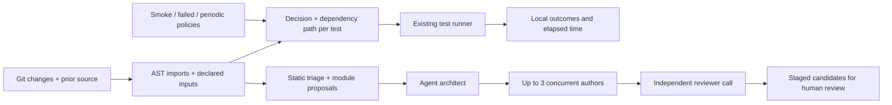

# Architecture and implemented contract

Status: implemented experimental core, September 29, 2026. Scope: JavaScript/TypeScript test files with supported names. No production readiness claim.

## Product contract

Produce a useful local health report with one setup command; explain every selected or omitted test file; widen execution when the supported dependency evidence is incomplete; preserve runner failures; keep generated proposals reviewable.

## Boundaries

- `files.js`: project discovery, configuration validation, path boundaries, Git execution.
- `graph.js`: TypeScript 6 compiler AST, dependency resolution, transitive traversal, uncertainty detection. TypeScript 7's different API is deliberately not used; the lockfile pins the compatible parser.
- `selector.js`: complete Git change discovery, old/current edge union, policy selection, and per-file reasons. No LLM in routing.
- `audit.js`: AST structural indicators and subject-based grouping. Import reachability is distinct from execution coverage.
- `runner.js`: argv file expansion, native exit code, shadow/full mode, history. Child Node runs do not inherit the enclosing Node test context.
- `swarm.js`: bounded JSON worker protocol, concurrency, validation, staged artifacts. No automatic candidate execution/application.
- `adapters/codex.js`: optional schema-constrained Codex CLI worker. No live model validation claim.
- `cli.js`: local onboarding and human/JSON output.

Selection names `full`, `affected`, `none`, or `policy`. `full` means all discovered files, not every test a framework could dynamically discover. The plan fingerprint records graph source/config/change evidence; it is a diagnostic identity, not a signed certificate or runtime trace. Plans are not reused as a persistent cache.

## Verification

Regression tests cover dependency chains, shared modules, assets, unknown inputs, config/locks, dynamic imports, parse errors, alias/workspace limitations, cycles, staged/unstaged/untracked changes, baseline edges, deletions/renames, nested project roots, failed-run retention, process errors, shadow mode, filenames containing spaces, worker rejection, traversal, timeouts, context bounds, and Codex request construction.

The synthetic benchmark measures selector overhead and compares planted changes against full fixture execution. Independent production-project benchmarking, mutation-effectiveness evaluation, remote agents, and per-test coverage are not yet verified.

## Key decisions

1. Start with static and declared evidence, rebuilding on each invocation. Runtime instrumentation and persisted coverage need stronger invalidation contracts than this first version has.
2. Conservative uncertainty affects the entire discovered suite. This costs precision but keeps unsupported resolution explicit. Framework-specific adapters may improve resolution with real runner evidence.
3. Keep policy and evidence visible. Exact ignore rules are explicit user decisions; smoke tests and failed history are retained independently of graph paths.
4. AI roles propose test improvements; they do not make selective-execution safety decisions. Candidate acceptance is separately labeled from runtime validation.
5. Use standard runner and mutation tools rather than replacing them. The agent worker protocol is an integration seam; mature frameworks such as Agentic QE can be connected by an adapter.
