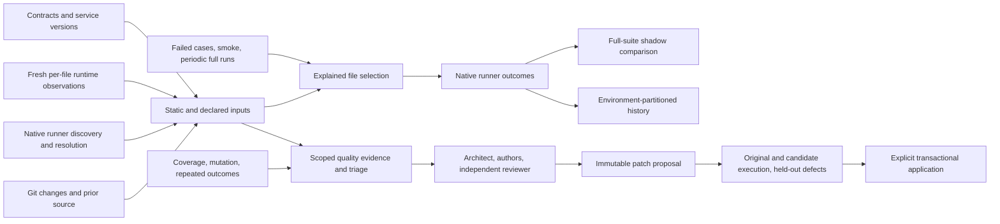

# Architecture and implemented contract

TestLore is an experimental local test intelligence layer. Deterministic evidence controls routing; agents propose test improvements.

- `files.js`, `graph.js`, `selector.js`: path boundaries, AST imports, TS resolution, current/prior edge union, native scope and policy decisions.
- `execution.js`, `reporters/`: native discovery, per-case outcomes and supported runner resolution. A successful process without a valid native report cannot certify collection.
- `provenance.js`, `inputs.js`, `evidence.js`, `runtime-hook.cjs`: source/dependency/environment identities, hashed service versions, measured quality, repeated runs, runtime observations and invalidation.
- `runner.js`: execution, failure history, source/service drift checks, shadow comparison. Passing a subset cannot clear failures from unexecuted files.
- `audit.js`: static structure and modular grouping alongside scoped measured evidence.
- `swarm.js`, `adapters/codex.js`: bounded worker requests and separate review roles. Routing never needs an AI account.
- `candidates.js`: immutable proposals, independent-oracle gate, disposable original/candidate runs, held-out defects, fresh validated application with rollback.
- `integrations.js`, `adapters/aqe.js`: native pytest-testmon/Nx/Bazel delegation and the actual optional AQE generation interface.
- `cli.js`, `action.yml`: onboarding, reproducible commands and retained CI receipts.

Selection operates at test-file granularity. Native results retain individual case identities. `full` means the discovered or explicitly declared native target scope. Incomplete native discovery blocks JS/TS execution instead of treating a static fallback as complete.

Runtime observations supplement static edges. Missing, stale, corrupt or incomplete required runtime evidence widens selection. Dynamic uncertainty stays conservative unless the project explicitly sets `runtime.closedWorld`; exercised paths cannot prove all possible behavior. Inputs unknown to both static and runtime evidence widen selection.

Provenance binds file content, runner/dependency state, declared environment, platform, Node version and hashed service versions. Integrity digests detect accidental receipt alteration; they are not signatures or an adversarial trust boundary. Reports and executable tools remain trusted local inputs. Reports cannot be retroactively rebound to changed source by omitting pre-run provenance.

Candidate execution uses disposable copies and trusted installed dependencies. Collection identity/outcome preservation and planted defects do not constitute formal semantic equivalence. Runtime observations and agent review do not authorize deployment automatically.

See [evidence](evidence.md), [runners](runners.md), [candidates](candidates.md), [integrations](integrations.md), and [roadmap evidence criteria](roadmap.md).
